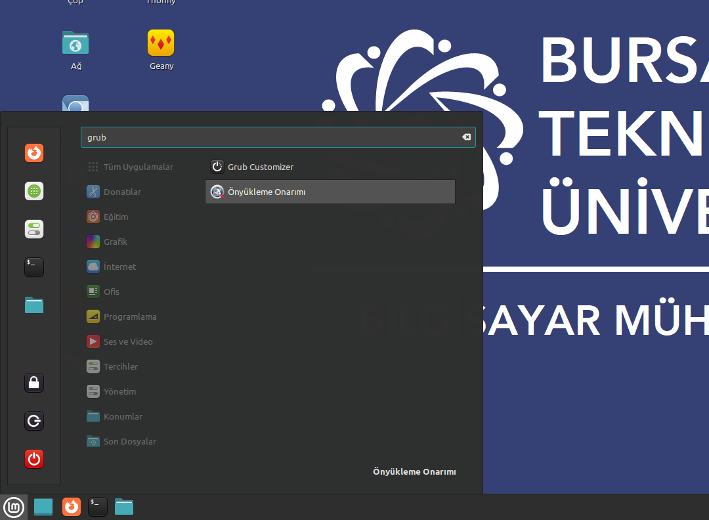
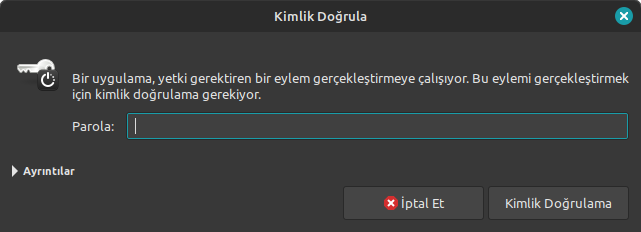
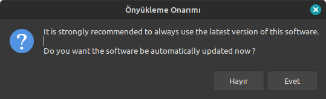
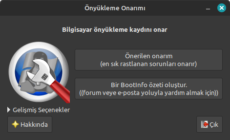
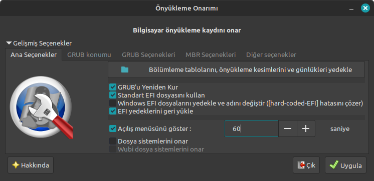
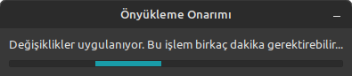
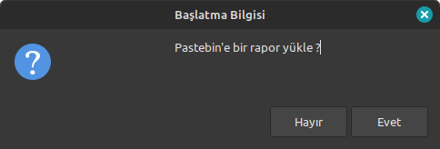
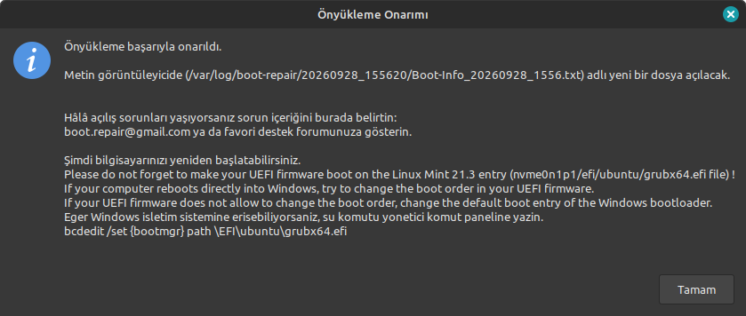
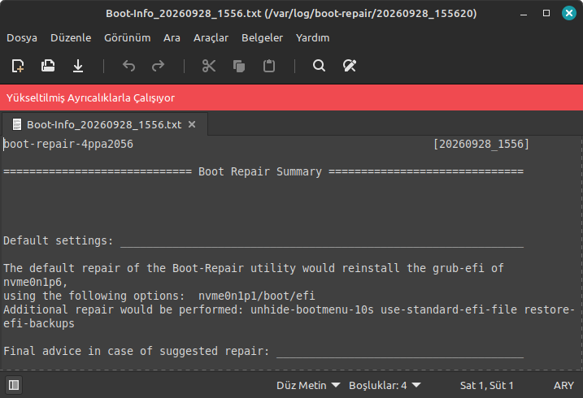

# GRUB Menüsünde Windows Seçeneğini Geri Getirme Kılavuzu

Laboratuvarlarımızdaki çift işletim sistemli (Dual-Boot: Linux & Windows) bilgisayarlarda, işletim sistemi güncellemeleri sonrasında GRUB açılış ekranında Windows seçeneği bazen kaybolabilmektedir. 

Bu sorunu çözmek için Linux ortamında yer alan **Önyükleme Onarımı (Boot Repair)** aracını çalıştırmanız yeterlidir. Aşağıdaki adımları sırasıyla takip edebilirsiniz:

---

### Adım 1: Önyükleme Onarımı Aracını Açma
Sol alttaki başlat menüsünü açın, arama kutusuna **"grub"** veya **"Önyükleme Onarımı"** (İngilizce ise *Boot Repair*) yazın ve çıkan uygulamayı başlatın.

---

### Adım 2: Yönetici Şifresini Girme
Uygulama açılırken yetkilendirme penceresi gelecektir. Standart kullanıcı şifrenizi girerek **"Kimlik Doğrula"** butonuna tıklayın.

---

### Adım 3: Güncelleme Uyarısını Geçme
Ekrana programın yeni bir sürümünün olduğunu belirten bir güncelleme sorusu gelebilir. Vakit kaybetmemek için **"Hayır"** diyerek bu adımı hızlıca geçebilirsiniz.

---

### Adım 4: Gelişmiş Seçenekleri Açma
Açılan basit menüde doğrudan önerilen onarımı başlatmak yerine, altta yer alan **"Gelişmiş seçenekler"** butonuna tıklayın.

---

### Adım 5: Menü Süresini Ayarlama ve Onarımı Başlatma
**"GRUB konumu"** sekmesinde yer alan **"Açılış menüsünü göster"** süresini **60** saniye (veya dilediğiniz bir süre) olarak ayarlayın. Ardından sağ alttaki **"Uygula"** butonuna basın.

---

### Adım 6: Onarım İşleminin Tamamlanmasını Bekleme
Araç önyükleme yapılandırmasını yeniden oluşturmaya ve onarmaya başlar. İşlem tamamlanana kadar birkaç saniye bekleyin.

---

### Adım 7: Rapor Yükleme İsteğini Reddetme
Onarım sırasında veya sonunda raporun pastebin sunucularına yüklenmesini isteyip istemediğinizi soran bir pencere çıkabilir. **"Hayır"** butonuna tıklayarak geçin.

---

### Adım 8: Başarı Onayını Alma
Ekranda **"Önyükleme başarıyla onarıldı."** mesajı belirecektir. **"Tamam"** butonuna basarak devam edin.

---

### Adım 9: Günlüğü Kapatma ve Yeniden Başlatma
İşlem sonrasında açılan metin belgesinde onarım günlüğü detayları yer alır. Bu belgeyi **kaydetmeden kapatabilirsiniz**.

> **Sonuç:** Bilgisayarınızı yeniden başlattığınızda GRUB menüsünde **Windows** seçeneğinin geri geldiğini göreceksiniz.
